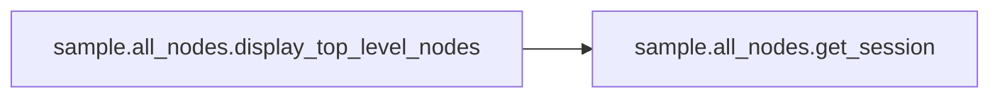
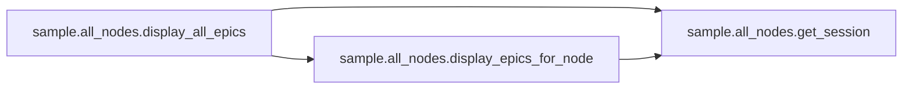
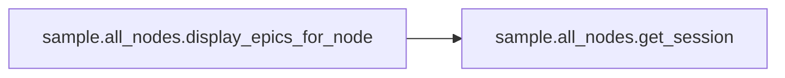

# Sample All Nodes

[_Documentation generated by Documatic_](https://www.documatic.com)

<!---Documatic-section-Codebase Structure-start--->
## Codebase Structure

<!---Documatic-block-system_architecture-start--->
```mermaid
None
```
<!---Documatic-block-system_architecture-end--->

# #
<!---Documatic-section-Codebase Structure-end--->

<!---Documatic-section-sample.all_nodes.display_top_level_nodes-start--->
## sample.all_nodes.display_top_level_nodes

<!---Documatic-section-display_top_level_nodes-start--->


### Object Calls

* sample.all_nodes.get_session

<!---Documatic-block-sample.all_nodes.display_top_level_nodes-start--->
<details>
	<summary><code>sample.all_nodes.display_top_level_nodes</code> code snippet</summary>

```python
def display_top_level_nodes():
    ig_service = get_session()
    response = ig_service.fetch_top_level_navigation_nodes()
    df = response['nodes']
    for record in df.to_dict('records'):
        print(f"{record['name']} [{record['id']}]")
```
</details>
<!---Documatic-block-sample.all_nodes.display_top_level_nodes-end--->
<!---Documatic-section-display_top_level_nodes-end--->

# #
<!---Documatic-section-sample.all_nodes.display_top_level_nodes-end--->

<!---Documatic-section-sample.all_nodes.display_all_epics-start--->
## sample.all_nodes.display_all_epics

<!---Documatic-section-display_all_epics-start--->


### Object Calls

* sample.all_nodes.get_session
* sample.all_nodes.display_epics_for_node

<!---Documatic-block-sample.all_nodes.display_all_epics-start--->
<details>
	<summary><code>sample.all_nodes.display_all_epics</code> code snippet</summary>

```python
def display_all_epics():
    ig_service = get_session()
    response = ig_service.fetch_top_level_navigation_nodes()
    df = response['nodes']
    for record in df.to_dict('records'):
        print(f"{record['name']} [{record['id']}]")
        display_epics_for_node(record['id'], space='  ', ig_service=ig_service)
```
</details>
<!---Documatic-block-sample.all_nodes.display_all_epics-end--->
<!---Documatic-section-display_all_epics-end--->

# #
<!---Documatic-section-sample.all_nodes.display_all_epics-end--->

<!---Documatic-section-sample.all_nodes.display_epics_for_node-start--->
## sample.all_nodes.display_epics_for_node

<!---Documatic-section-display_epics_for_node-start--->


### Object Calls

* sample.all_nodes.get_session

<!---Documatic-block-sample.all_nodes.display_epics_for_node-start--->
<details>
	<summary><code>sample.all_nodes.display_epics_for_node</code> code snippet</summary>

```python
def display_epics_for_node(node_id=0, space='', ig_service=None):
    if ig_service is None:
        ig_service = get_session()
    sub_nodes = ig_service.fetch_sub_nodes_by_node(node_id)
    if sub_nodes['nodes'].shape[0] != 0:
        rows = sub_nodes['nodes'].to_dict('records')
        for record in rows:
            print(f"{space}{record['name']} [{record['id']}]")
            display_epics_for_node(record['id'], space=space + '  ', ig_service=ig_service)
    if sub_nodes['markets'].shape[0] != 0:
        cols = sub_nodes['markets'].to_dict('records')
        for record in cols:
            print(f"{space}{record['instrumentName']} ({record['expiry']}): {record['epic']}")
```
</details>
<!---Documatic-block-sample.all_nodes.display_epics_for_node-end--->
<!---Documatic-section-display_epics_for_node-end--->

# #
<!---Documatic-section-sample.all_nodes.display_epics_for_node-end--->

<!---Documatic-section-sample.all_nodes.get_session-start--->
## sample.all_nodes.get_session

<!---Documatic-section-get_session-start--->
<!---Documatic-block-sample.all_nodes.get_session-start--->
<details>
	<summary><code>sample.all_nodes.get_session</code> code snippet</summary>

```python
def get_session():
    ig_service = IGService(config.username, config.password, config.api_key, config.acc_type, acc_number=config.acc_number, retryer=DEFAULT_RETRY)
    ig_service.create_session(version='3')
    return ig_service
```
</details>
<!---Documatic-block-sample.all_nodes.get_session-end--->
<!---Documatic-section-get_session-end--->

# #
<!---Documatic-section-sample.all_nodes.get_session-end--->

[_Documentation generated by Documatic_](https://www.documatic.com)